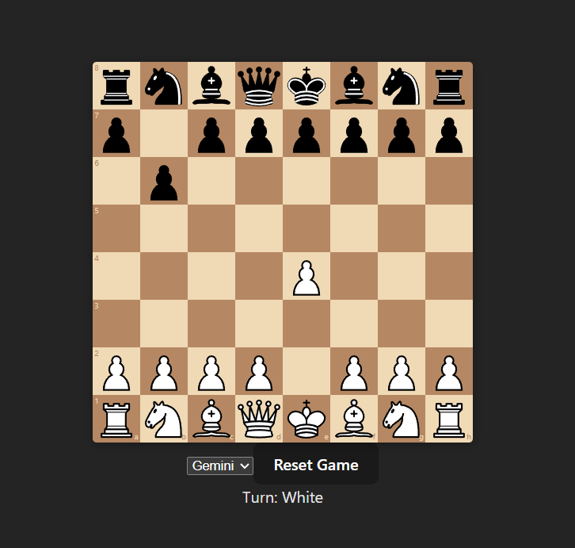
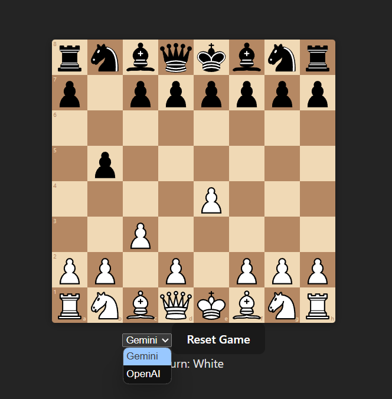

# AI Chess

This is a simple chess game where player plays against an AI of his choice.

[Video demo](https://drive.google.com/file/d/1rZMEecMuBHfOFbEUSdAlZpDOaF746H7Z/view)

## Tech Stack
- React Js
- Flask

## Setup Instructions

1. Clone the repository
2. Install the necessary dependencies for frontend using
```
    yarn install
```

3. Go to backend directory and install necessary dependencies

```
    cd backend && pip install -r requirements.txt
```

4. Run the react frontend by running the following command

```
    yarn dev
```

5. Run the backend (from backend directory) using the following command

```
    python3 server.py
```

6. Dev instances of frontend and backend run on the ports 5175 and 5000 respectively


## Screenshots of the projects




